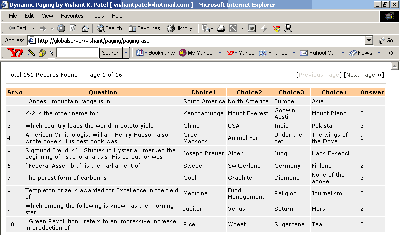



## Dynamic Recordset Paging in ASP

### Description

In development of dynamic website using ASP, recordset paging is one of the very useful feature. This code "Dynamic Paging in ASP" makes the recordset paging a child's play. You just have to modify three parameters in the paging.asp file and voila, you can use this code anywhere in you website. Just gives the name of database file, name of table and no. of records to display. That's it ! I am sure it will be a very handy code for any serious ASP Developer.
 
### More Info
 
Database File Name, Table Name and No. of Records to display on a Page

             |
---                |---
**Submitted On**   |2001-10-10 13:34:00
**By**             |[Vishant K\. Patel](https://github.com/Planet-Source-Code/PSCIndex/blob/master/ByAuthor/vishant-k-patel.md)
**Level**          |Intermediate
**User Rating**    |5.0 (10 globes from 2 users)
**Compatibility**  |VB Script, ASP \(Active Server Pages\) 
**Category**       |[Databases/ Data Access/ DAO/ ADO](https://github.com/Planet-Source-Code/PSCIndex/blob/master/ByCategory/databases-data-access-dao-ado__1-6.md)
**World**          |[Visual Basic](https://github.com/Planet-Source-Code/PSCIndex/blob/master/ByWorld/visual-basic.md)
**Archive File**   |[Dynamic Re282171092001\.zip](https://github.com/Planet-Source-Code/vishant-k-patel-dynamic-recordset-paging-in-asp__1-27943/archive/master.zip)

